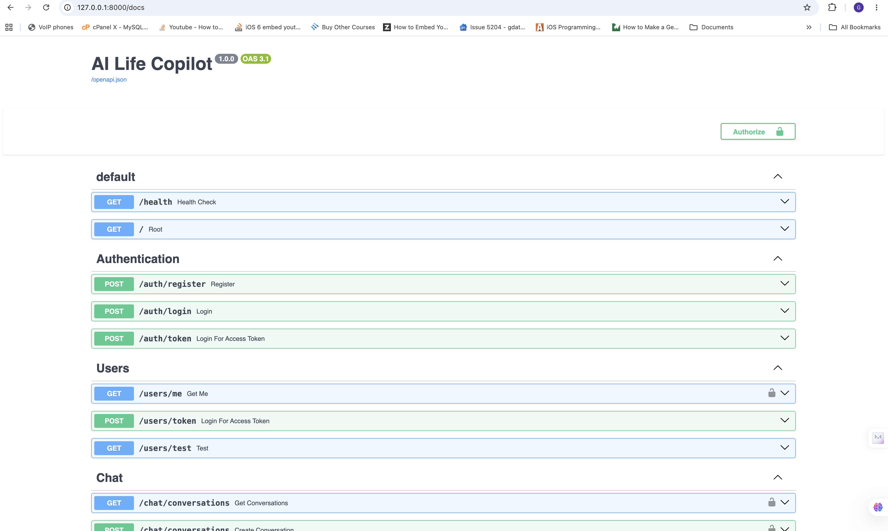
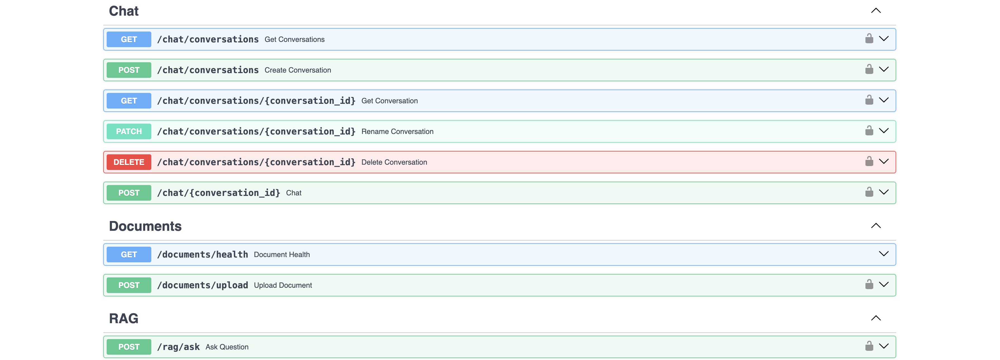
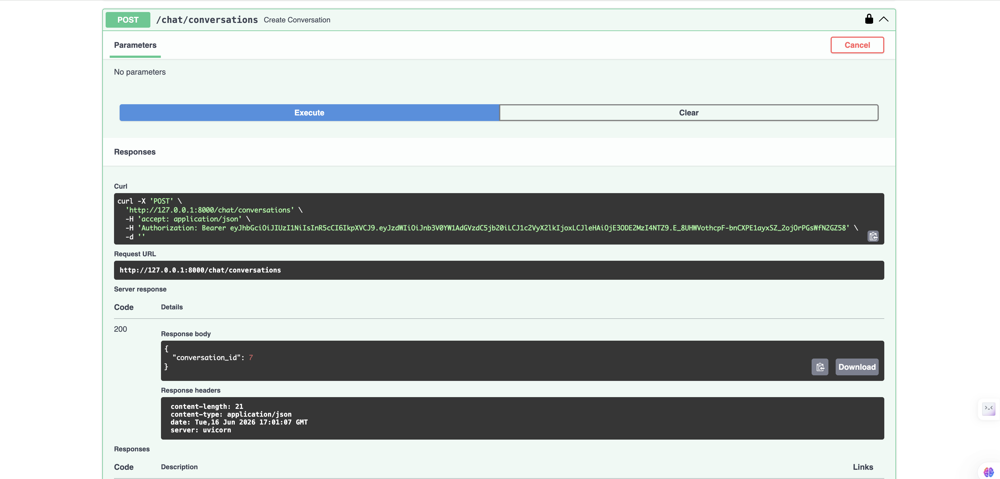
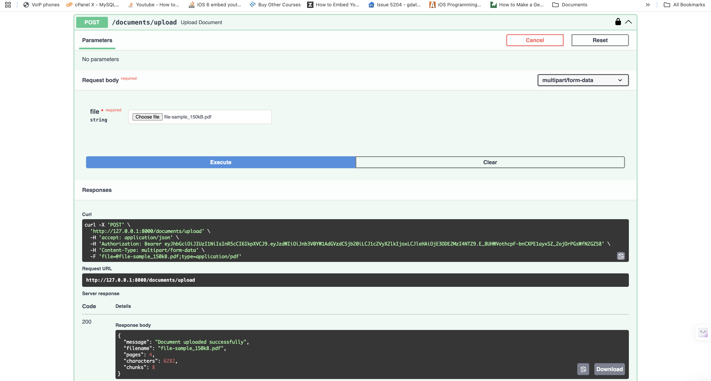

# AI Life Copilot – Production-Ready Agentic RAG Assistant

## Overview

AI Life Copilot is a production-ready Agentic AI Assistant built using FastAPI, LangGraph, Amazon Bedrock, PostgreSQL, and pgvector.

The application enables users to:

* Engage in AI-powered conversations
* Upload PDF documents
* Ask questions against uploaded documents using Retrieval-Augmented Generation (RAG)
* Maintain persistent conversation history
* Leverage a multi-agent architecture for intelligent routing and response generation

This project demonstrates modern Generative AI engineering practices including agent orchestration, vector search, document processing, cloud deployment, authentication, and scalable backend development.

---

## Resume Summary

Designed and deployed a production-ready Agentic AI Assistant using FastAPI, LangGraph, Amazon Bedrock, PostgreSQL, and pgvector. Implemented a multi-agent architecture for conversational AI and Retrieval-Augmented Generation (RAG), supporting document ingestion, semantic search, and contextual question answering. Containerized and deployed on AWS ECS Fargate using Docker and IAM-based cloud security.

## Key Features

### Conversational AI

* Multi-turn AI conversations
* Persistent conversation history
* User-specific chat sessions
* JWT-based authentication
* Context-aware responses

### Retrieval-Augmented Generation (RAG)

* Upload PDF documents
* Automatic document parsing
* Text chunking
* Vector embedding generation
* Semantic similarity search
* Context-aware question answering

### Agentic AI Workflow

Built using LangGraph with multiple specialized agents:

#### Supervisor Agent

Responsible for:

* Understanding user intent
* Routing requests
* Selecting the appropriate workflow

#### Retrieval Agent

Responsible for:

* Searching vector database
* Retrieving relevant document chunks
* Building contextual information

#### Memory Agent

Responsible for:

* Loading conversation history
* Maintaining context across interactions

#### Validation Agent

Responsible for:

* Validating retrieved content
* Ensuring response quality

#### Answer Agent

Responsible for:

* Constructing prompts
* Invoking Amazon Bedrock
* Generating final responses

---

## Architecture

```text
                        ┌──────────────────┐
                        │      User        │
                        └────────┬─────────┘
                                 │
                                 ▼
                    ┌────────────────────────┐
                    │       FastAPI API      │
                    └───────────┬────────────┘
                                │
                                ▼
                     ┌────────────────────┐
                     │ Supervisor Agent   │
                     └─────────┬──────────┘
                               │
          ┌────────────────────┼────────────────────┐
          ▼                    ▼                    ▼

 ┌────────────────┐   ┌────────────────┐   ┌────────────────┐
 │ Retrieval      │   │ Memory         │   │ Validation     │
 │ Agent          │   │ Agent          │   │ Agent          │
 └────────┬───────┘   └────────┬───────┘   └────────┬───────┘
          │                    │                    │
          └────────────────────┼────────────────────┘
                               ▼

                    ┌────────────────────┐
                    │   Answer Agent     │
                    └─────────┬──────────┘
                              │
                              ▼

                 ┌─────────────────────────┐
                 │ Amazon Bedrock Nova     │
                 └─────────────────────────┘
```

---

## RAG Pipeline

### Document Processing

```text
PDF Upload
     │
     ▼
Document Parsing
     │
     ▼
Text Chunking
     │
     ▼
Embedding Generation
     │
     ▼
pgvector Storage
```

### Question Answering

```text
User Question
      │
      ▼
Embedding Generation
      │
      ▼
Vector Similarity Search
      │
      ▼
Retrieve Top Chunks
      │
      ▼
Prompt Construction
      │
      ▼
Amazon Bedrock
      │
      ▼
Generated Answer
```

---

## Technology Stack

### Backend

* Python 3.12
* FastAPI
* SQLAlchemy
* Pydantic

### Agent Framework

* LangChain
* LangGraph

### Generative AI

* Amazon Bedrock
* Amazon Nova Lite

### Vector Database

* PostgreSQL
* pgvector

### Authentication

* JWT Authentication
* Password Hashing

### Cloud Infrastructure

* AWS ECS Fargate
* Amazon ECR
* IAM Roles
* Security Groups
* VPC Networking

### Containerization

* Docker
* Docker Compose

---

## Application Screenshots

### Swagger API Documentation




### Conversation Creation



### Document Upload



## Project Structure

```text
ai-life-copilot-backend/
│
├── app/
│   │
│   ├── agents/
│   │   ├── answer_agent.py
│   │   ├── chat_agent.py
│   │   ├── graph.py
│   │   ├── memory_agent.py
│   │   ├── nodes.py
│   │   ├── retrieval_agent.py
│   │   ├── state.py
│   │   ├── supervisor_agent.py
│   │   └── validation_agent.py
│   │
│   ├── api/
│   │   └── routes/
│   │       ├── auth.py
│   │       ├── chat.py
│   │       ├── documents.py
│   │       └── rag.py
│   │
│   ├── core/
│   │   ├── config.py
│   │   ├── database.py
│   │   ├── logger.py
│   │   └── security.py
│   │
│   ├── db/
│   │
│   ├── models/
│   │   ├── conversation.py
│   │   ├── document.py
│   │   ├── document_chunk.py
│   │   ├── document_embedding.py
│   │   ├── message.py
│   │   └── user.py
│   │
│   ├── schemas/
│   │   ├── auth.py
│   │   ├── chat.py
│   │   ├── conversation.py
│   │   ├── document.py
│   │   └── rag.py
│   │
│   ├── services/
│   │   ├── auth_service.py
│   │   ├── bedrock_llm_service.py
│   │   ├── chat_service.py
│   │   ├── chunking_service.py
│   │   ├── document_chunk_service.py
│   │   ├── document_embedding_service.py
│   │   ├── embedding_service.py
│   │   ├── langchain_llm_service.py
│   │   ├── llm_service.py
│   │   ├── memory_service.py
│   │   ├── pdf_service.py
│   │   ├── provider_factory.py
│   │   ├── rag_prompt_service.py
│   │   ├── rag_service.py
│   │   ├── retrieval_service.py
│   │   └── vector_search_service.py
│   │
│   └── main.py
│
├── alembic/
│   ├── env.py
│   └── versions/
│
├── uploads/
├── tests/
│
├── Dockerfile
├── docker-compose.yml
├── requirements.txt
├── alembic.ini
└── README.md
```

---

## API Endpoints

### Authentication

```http
POST /auth/register
POST /auth/login
```

### Conversations

```http
GET    /chat/conversations
POST   /chat/conversations
GET    /chat/conversations/{conversation_id}
PATCH  /chat/conversations/{conversation_id}
DELETE /chat/conversations/{conversation_id}
```

### Chat

```http
POST /chat/{conversation_id}
```

### Documents

```http
POST /documents/upload
GET  /documents/health
```

### RAG

```http
POST /rag/ask
```

---

## Example RAG Request

### Request

```json
{
  "question": "What is Artificial Intelligence?",
  "conversation_id": 1
}
```

### Response

```json
{
  "answer": "Artificial Intelligence is...",
  "sources": [12, 15, 18]
}
```

---

## Security Features

* JWT Authentication
* Password Hashing
* Protected API Endpoints
* User-level Conversation Isolation
* IAM-based Bedrock Access
* Secure Database Connectivity

---

## AWS Deployment Architecture

```text
                    ┌────────────────────┐
                    │      Client        │
                    └──────────┬─────────┘
                               │
                               ▼

                  ┌────────────────────────┐
                  │ AWS ECS Fargate        │
                  │ FastAPI Application    │
                  └──────────┬─────────────┘
                             │
               ┌─────────────┴─────────────┐
               ▼                           ▼

      ┌──────────────────┐      ┌───────────────────┐
      │ Amazon Bedrock   │      │ PostgreSQL        │
      │ Nova Lite        │      │ + pgvector        │
      └──────────────────┘      └───────────────────┘
```

---

## Deployment

The application is containerized using Docker and deployed on AWS ECS Fargate.

### AWS Services Used

- Amazon ECS Fargate
- Amazon ECR
- Amazon Bedrock
- IAM Roles
- Security Groups
- PostgreSQL Database
- CloudWatch Logs

This deployment demonstrates production-ready AI application hosting on AWS infrastructure.

## Local Setup

### Clone Repository

```bash
git clone https://github.com/goutamroy/ai-life-copilot
cd ai-life-copilot-backend
```

### Create Virtual Environment

```bash
python -m venv venv
source venv/bin/activate
```

### Install Dependencies

```bash
pip install -r requirements.txt
```

### Configure Environment Variables

Create a `.env` file:

```env
DATABASE_URL=
JWT_SECRET_KEY=
AWS_REGION=us-east-1
BEDROCK_MODEL_ID=amazon.nova-lite-v1:0
```

### Run Application

```bash
uvicorn app.main:app --reload
```

Swagger UI:

```text
http://localhost:8000/docs
```

---

## Docker Deployment

Build Docker image:

```bash
docker build -t ai-life-copilot-backend .
```

Run container:

```bash
docker run -p 8000:8000 ai-life-copilot-backend
```

---

## Challenges Solved During Development

* Designing a multi-agent architecture using LangGraph
* Building a production-ready RAG pipeline
* Implementing vector search using pgvector
* Integrating Amazon Bedrock for LLM inference
* Managing AWS IAM permissions and Bedrock access
* Containerizing the application using Docker
* Deploying to AWS ECS Fargate
* Handling Bedrock throttling and quota management
* Securing APIs using JWT authentication
* Managing document ingestion and retrieval workflows

---

## Future Enhancements

* Streaming responses
* Multi-document retrieval
* Hybrid search (vector + keyword)
* Agent memory optimization
* Evaluation and observability dashboards
* Multi-modal document support
* Knowledge graph integration
* Frontend web application
* Native iOS application integration

---

## Skills Demonstrated

* Generative AI Engineering
* Retrieval-Augmented Generation (RAG)
* Agentic AI Systems
* LangGraph Workflows
* Amazon Bedrock Integration
* LLM Application Development
* Vector Databases
* FastAPI Backend Development
* Docker & Containerization
* AWS Cloud Deployment
* ECS Fargate
* IAM Security
* PostgreSQL & pgvector
* Production AI Systems

---

## Author

Goutam Roy

Software Engineer | AI Engineer | Generative AI & Agentic AI Enthusiast

### Connect

- LinkedIn: https://www.linkedin.com/in/goutam-roy-1a616459/
